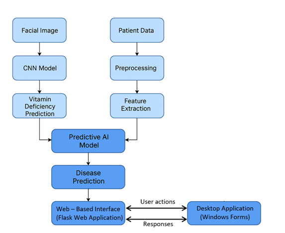

# Data-Driven-Predictive-AI-Systems-for-Medical-Diseases
This project introduces an AI-based medical assistant built with Windows Forms, designed to predict four common diseases such as Heart Disease, Stroke, Diabetes, Vitamin Deficiency.

An AI-based medical prediction system that combines Machine Learning,
Deep Learning, Flask, REST APIs, and C# Windows Forms to support
early prediction of common diseases.

## 🚀 Project Overview

The system predicts:

- Heart Disease
- Stroke
- Diabetes
- Vitamin Deficiency

Machine Learning algorithms such as Decision Tree and Random Forest
are used for structured patient data, while a CNN model is used for
image-based vitamin deficiency detection.

## 🎯 Objectives

- Predict diseases using patient health data.
- Detect vitamin deficiency using medical images.
- Combine Machine Learning and Deep Learning.
- Provide real-time prediction results.
- Provide a user-friendly Flask web interface.
- Provide a C# Windows Forms interface for doctors.
- Enable communication between patients and doctors through chat.

## 🛠️ Technologies Used

### Programming Languages
- Python
- C#

### Machine Learning
- Pandas
- scikit-learn
- Decision Tree
- Random Forest

### Deep Learning
- TensorFlow
- Keras
- CNN

### Backend
- Flask
- REST API

### Desktop Application
- C#
- .NET
- Windows Forms

## 🏗️ System Architecture

The project follows a client-server architecture.

```text
          Patient/User
               |
               v
        Flask Web Application
               |
               v
            REST API
               |
               v
          Python Backend
               |
     +-------------------+
     |                   |
     v                   v
Machine Learning       CNN Model
Decision Tree          Image Analysis
Random Forest              |
     |                      |
     +----------+-----------+
                |
                v
        Prediction Result
                |
                v
       C# Windows Forms
         Doctor Application
                |
                v
          Doctor Feedback

## 📸 Screenshots

### 🩺 Disease Deficiency Detection


### 😊 Emoji Feedback


### 📥 Inbox Interface – Desktop Application


### 🧬 Predict Vitamin Page


### 💻 Reply Interface – Desktop Application


### 🔬 Vitamin Detection Result


### 📊 Sequence Diagram


### 💬 Web Chat Interface


### 🔄 Workflow


